# Trees 
> ## B-Trees

https://github.com/itamames/Lecture10

## The Model of the B Trees  
In computer science, a B-tree is a self-balancing tree data structure that maintains sorted data and allows searches, sequential access, insertions, and deletions in logarithmic time. The B-tree generalizes the binary search tree, allowing for nodes with more than two children. Unlike other self-balancing binary search trees, the B-tree is well suited for storage systems that read and write relatively large blocks of data, such as databases and file systems.

Bayer and McCreight never explained what, if anything, the B stands for: Boeing, balanced, broad, bushy, and Bayer have been suggested. McCreight has said that "the more you think about what the B in B-trees means, the better you understand B-trees."

(source wikipedia, https://en.wikipedia.org/wiki/B-tree)

Entire data structures for large datasets cannot be stored in main memory. They must be stored in hard drives. Althought virtual and solid-state drives help, until recently HDD were the only feasible long term storage.

Big-Oh analysis assumes that all operations are equal. However, this is not true, especially when disk I/O is involved. Storing it on disk requires different approach to efficiency.

Assuming that a disk spins at 7200 RPM,  one revolution occurs in 1/120 of a second, or 8.3 ms.Consequently, we can do approximately 120 disk accesses per second. One disk access takes about the same time as 100,000 CPU instructions.

### Example
Assume that we use an AVL tree to store about 10 million records.

We are 1 of 20 users on a system (so we have 1/20 of the resources). Thus, in 1 sec, we can execute billions of instructions or perform 6 disk accesses (120/20).

On average, a successful search would  require  ClogN (C ≈ 1.38) disk accesses, and since log210.000.000 ≈ 24, an average search would require 32 disk accesses, or 5 sec.

We can’t improve on the O(logN) lower bound on search for a binary tree.

What can we do?

.

.

.

The solution is to use more branches and thus reduce the height of the tree! As branching increases, depth decreases!!!

## B–Trees.  Definition 

A B-tree of order M is an M-ary tree (i.e., a tree where each node may have up to M children) in which:
* The data items are stored at leaves.
* The nonleaf nodes store up to M − 1 keys to guide the searching.
* The root is either a leaf node, or it has from 2 to M children
* All nonleaf nodes (except the root) have between M/2 and M children.
* All leaves are at the same depth and have between L/2 and L data items, for some L (the determination of L is described shortly).

## Example
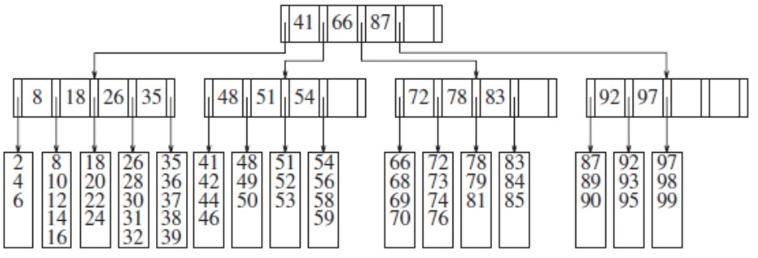

B-Tree of order 5

Each node represents a disk block, so we choose M and L on the basis of the size of the items that are being stored. 

* The data items are stored at leaves.
* The nonleaf nodes store up to 5−1 keys to guide the searching.
* The root has from 2 to 5 children
* All nonleaf nodes (except the root) have between 5/2 and 5 children.
* All leaves are at the same depth and have between L/2 and L data items, for some L. For this example L=M=5.
* Each node represents a disk block, so we choose M and L on the basis of the size of the items that are being stored. 

a) Suppose we want to insert 57 into this B-tree:
* A search down the tree reveals that it is not already in the tree. We can then add it to the leaf as a fifth item

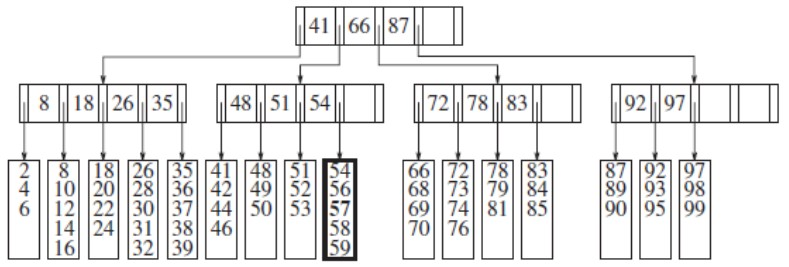

Note that we may have to reorganize all the data in the leaf to do this. However, the cost of doing this is negligible when compared to that of the disk access, which in this case also includes a disk write.

b) Now suppose we want to insert 55 next:

* The leaf where 55 wants to go is already full!
* The solution is simple: we split them into two leaves, both guaranteed to have the minimum number of data records needed. We form two leaves with three items each. 
* Two disk accesses are required to write these leaves, and a third disk access is required to update the parent.

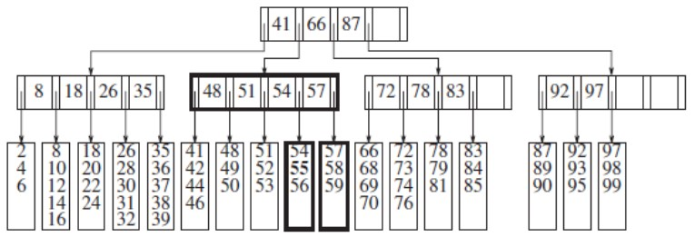

There are other ways to handle the overflowing of children. 
One technique is to put a child up for adoption should a neighbor have room. 

c) Insert 29 into the next B-tree.

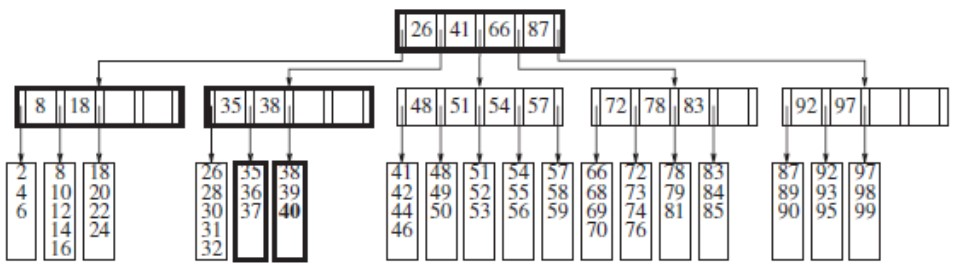

* Make room by moving 32 to the next leaf. 
* This technique requires a modification of the parent because the keys are affected. 

## Example 
Suppose we start with an empty B-tree and keys arrive in the following order:

{1, 12, 8, 2, 25, 6, 14, 28, 17, 7, 52, 16, 48, 68, 3, 26, 29, 53,55,45}

### How to construct a B-Tree of order 5?

The first four items (in sorter order) go into the root:

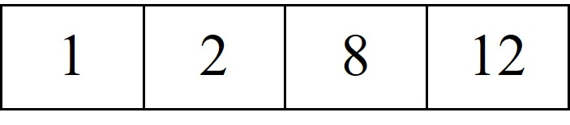

* To put the fifth item in the root would violate the definition (M-1 keys…)
* Therefore, when 25 arrives, pick the middle key to make a new root

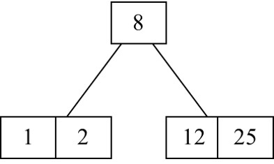

* 6, 14, 28 get added to the leaf nodes:

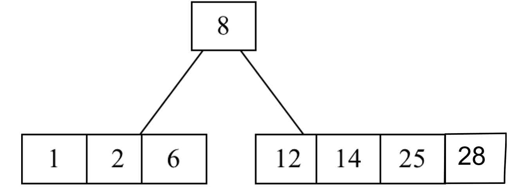

* Adding 17 to the right leaf node would over-fill it, so we take the middle key, promote it (to the root) and split the leaf.

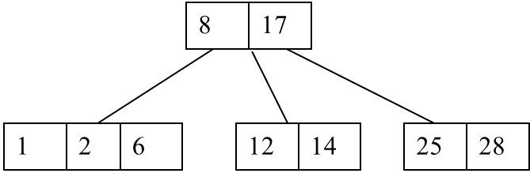

* 7, 52, 16, 48 get added to the leaf nodes

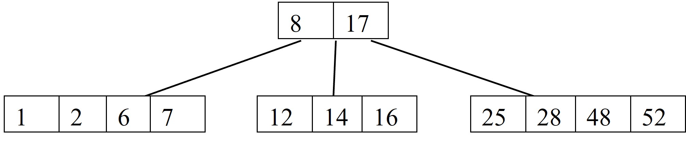

* Adding 68 causes us to split the right most leaf, promoting 48 to the root, and adding 3 causes us to split the left most leaf, promoting 3 to the root; 26, 29, 53, 55 then go into the leaves

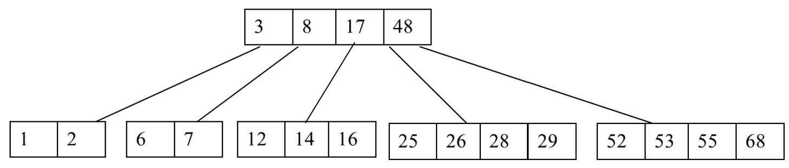

* Adding the final item 45 to the root, will cause the middle one to elevate and create a new root and do some reshuffling.

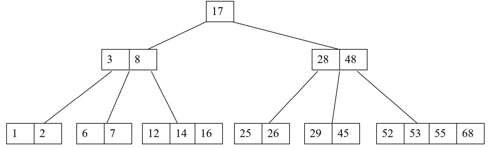

## Algorithm Visualization

https://www.cs.usfca.edu/~galles/visualization/BTree.html

## Algorithm Implementation

http://algs4.cs.princeton.edu/code/edu/princeton/cs/algs4/BTree.java.html

# Class Problem

a) Insert 375 into the following BTree of order 5:

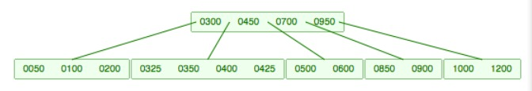

b) Insert 700 into the following BTree:

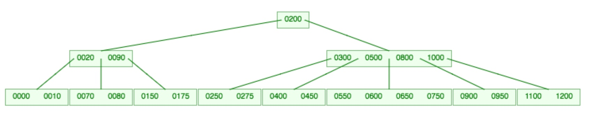

c) Delete 80 from the following BTree:

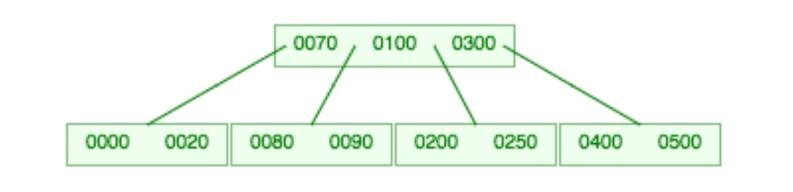
